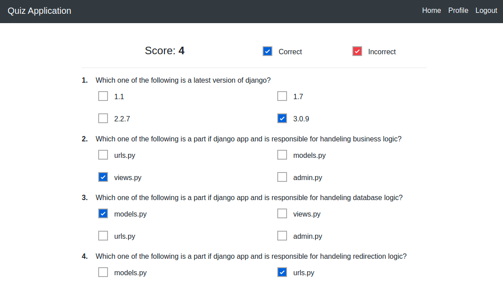

# quiz_django

A simple quiz application built with html5, css3, jquery, bootstrap4.5 and django. Added functionalities for serving static files and media files through Amazon S3 buckets.

## Getting started

git clone https://github.com/ccir41/quiz_django

cd quiz_django

### using docker
`docker build . -t django-quiz-app`
`docker volume create quiz_volume`
`docker run --name django-quiz-app -d -p 9000:9000 -v quiz_volume:/app django-quiz-app`

## Create virtual environment and activate it

### Ubuntu
sudo apt-get install -y python3-venv
python3 -m venv quiz-venv

source quiz-venv/bin/activate

### Windows

py -m venv quiz-venv

quiz-venv\Scripts\activate.bat

## Install requirements

pip3 install -r requirements.txt

*If you get mysqlclient error in ubuntu while installing requirement.txt try running command sudo apt-get install libmysqlclient-dev* 

python manage.py makemigrations user quiz

python manage.py migrate

### Create Admin User

python manage.py createsuperuser

### Loding sample quiz from json file

python manage.py loaddata db.json

### Run development server

python manage.py runserver 127.0.0.1:8000

**Visit 127.0.0.1:8000**
This is the home page of our quiz application which displays the quiz categories. If there were no quiz categories, they can be added by signing with admin user and navigating to admin section at top of navigation bar. Similiarly quiz exam and questions also can be added and updated with admin page.

To give exam you have to click either of the categories which takes you to the exam page and by clicking any of the exam takes you to the questions page.

The user **response** will be displayed right after submitting the quiz exam.

**_In order to take exam, you should signed in_**

##snapshots of quiz apps are

**admin page**

**category admin page**

**quiz home page**

**quiz home page after login**

**question list page**

**quiz exam page**

**quiz result page**

**user profile page**
